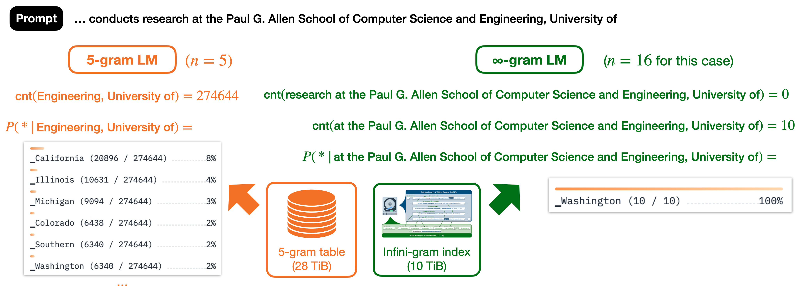
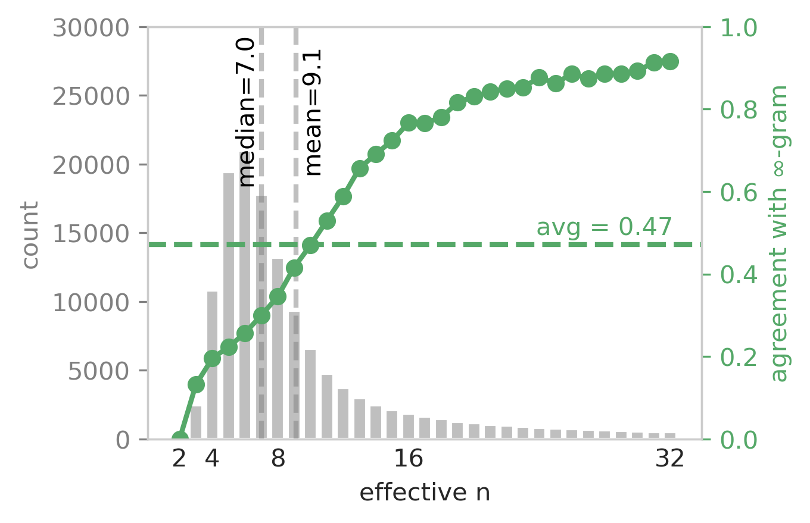
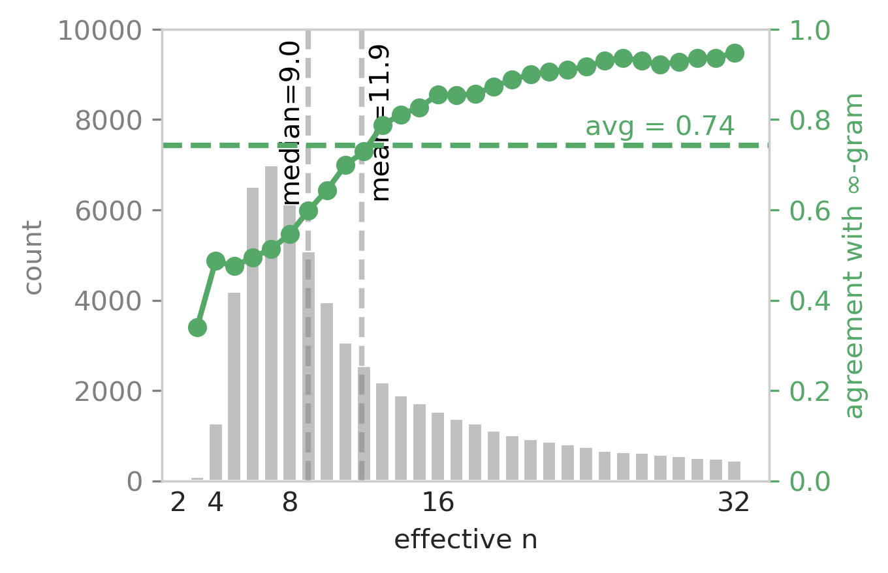
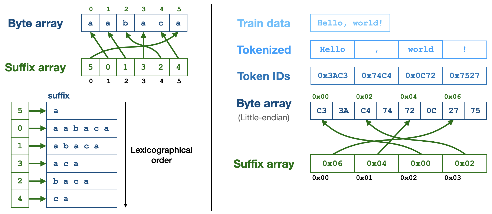
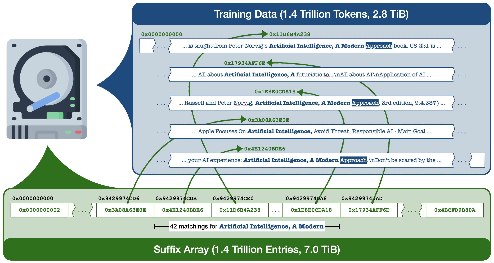

<h2 align="center">📖 <b>Infini-gram: Scaling Unbounded n-gram Language Models to a Trillion Tokens</b></h2>

<p align="center"><a href="https://liujch1998.github.io">Jiacheng Liu</a><sup>1</sup>, <a href="https://shmsw25.github.io">Sewon Min</a><sup>1</sup>, <a href="https://www.cs.washington.edu/people/faculty/lsz/">Luke Zettlemoyer</a><sup>1</sup>, <a href="https://homes.cs.washington.edu/~yejin/">Yejin Choi</a><sup>1,2</sup>, <a href="https://homes.cs.washington.edu/~hannaneh/">Hannaneh Hajishirzi</a><sup>1,2</sup></p>

<p align="center"><sup>1</sup>University of Washington, <sup>2</sup>Allen Institute for AI</p>

<p align="center">[<a href="https://hf.co/spaces/liujch1998/infini-gram">Web Interface</a>] [<a href="/api_doc">API Endpoint</a>] [<a href="/pkg_doc">Python Package</a>] [<a href="https://infini-gram.readthedocs.io">Docs</a>] [<a href="https://github.com/liujch1998/infini-gram">Code</a>] [<a href="https://arxiv.org/pdf/2401.17377.pdf">Paper</a>]</p>

**[✨NEW]** Check out [**infini-gram mini**](https://infini-gram-mini.io/), a more storage-efficient index based on FM-index, with similar functionalities as infini-gram.

**[✨NEW]** Check out [**OLMoTrace**](https://allenai.org/blog/olmotrace), an LLM behavior tracing tool we developed on top of infini-gram.

<p>Join our <a href="https://discord.gg/wAhjwbjECW">Discord server</a>! Get the latest updates & maintenance announcements, ask the developer anything about infini-gram, and connect with other fellow users.</p>

---
<br/>

It’s year 2024, and n-gram LMs are making a comeback!!

We built an n-gram LM with the union of several open text corpora: {[Dolma](https://huggingface.co/datasets/allenai/dolma), [RedPajama](https://huggingface.co/datasets/togethercomputer/RedPajama-Data-1T), [Pile](https://huggingface.co/datasets/EleutherAI/pile), and [C4](https://huggingface.co/datasets/allenai/c4)}.
The "n" in this n-gram LM can be arbitrarily large.
This model is trained on **5 trillion tokens**, and contains n-gram counts for about 5 quadrillion (or 5 thousand trillion, or 5x10^15) unique n-grams.
It is **the biggest n-gram LM ever built to date**.

**Infini-gram** is an engine that efficiently processes n-gram queries with **unbounded n** and **trillion-token massive corpora**.
It takes merely 20 milliseconds to count an arbitrarily long n-gram in RedPajama (1.4T tokens), while also retrieving all of its occurrence positions in the corpus.

<p align="center">
  
</p>

Beyond counting n-grams, infini-gram offers more functionalities.
You can compute n-gram LM probabilities and next-token distributions, which can be handy for text decoding.
You can also search for documents that contain an n-gram term, one of multiple n-gram terms, all of multiple n-gram terms, or a combination of these (see [CNF expressions](https://en.wikipedia.org/wiki/Conjunctive_normal_form)).
To explore these functionalities, check out our [web interface](https://hf.co/spaces/liujch1998/infini-gram).

<p align="center">
  
</p>

If you'd like to explore infini-gram or use in small volume, please check out our [web interface](https://hf.co/spaces/liujch1998/infini-gram).
If you'd like to programmatically query infini-gram, we offer a free and easy-to-use API endpoint, please check out the [API documentation](/api_doc.md).

---
<br/>

<h2 align="center">What can I use infini-gram for?</h2>

In our paper, we use infini-gram to **analyze text**, both human-written and machine-generated.
We also use infini-gram for **language modeling**: the ∞-gram LM, which is powered by infini-gram, can complement neural LMs and greatly reduce their perplexity.

We are very excited that infini-gram is being actively used by our fellow research groups in these areas:
1. **Memorization**
2. **Membership inference**
3. **Text generation**
4. **Document retrieval**
5. **Dataset curation**
6. **Copyright protection**

Beyond these, we envision that infini-gram can be useful in many other applications, such as:
1. **Understanding text corpora**
1. **Attribution**
1. **Detecting data contamination and plagiarism**
1. **Reducing hallucination**
1. **Speculative decoding**
1. **Offloading rote memorization from neural models**

Below we show a few results from our paper, which uses infini-gram for text analysis and language modeling.

---
<br/>

<h2 align="center">Why do we need unbounded n?</h2>

Using larger n improves the predictive power of n-gram LMs. Existing n-gram LMs are mostly built with n<=5, which limits their capability to predict the next token (shown in image below). If we increase to n=16, we still get a non-zero n-gram count in RedPajama, but now the model makes a correct prediction. This is why we generalize n-gram LMs to unbounded n, i.e., an ∞-gram LM. ∞-gram uses the longest context possible (right before the count becomes zero), and our infini-gram engine perfectly supports this.

<p align="center">
  
</p>

---
<br/>

<h2 align="center">Analyzing human-written text</h2>

Using the ∞-gram framework and infini-gram engine, we gain new insights into human-written and machine-generated text.

∞-gram is predictive of human-written text on 47% of all tokens, and this is a lot higher than 5-gram (29%). This prediction accuracy is much higher among tokens that can use a larger n (left image), and is also higher when the ∞-gram estimate is sparse (right image).

<p align="center">
  
  
</p>

---
<br/>

<h2 align="center">Interpolating ∞-gram LM with neural LMs</h2>

Interpolating with ∞-gram reduces the perplexity of neural LLMs by up to 73%, and this works even when the neural LLM is Llama-2-70B! ∞-gram also outperforms kNN-LM and RIC-LM as retrieval-augmentation strategy used by the SILO model (Min et al., 2023).

<p align="center">
  
  
</p>

---
<br/>

<h2 align="center">What's happening behind the infini-gram engine?</h2>

The infini-gram index is a data structure called "suffix array", which stores the ranking of all suffixes of a byte array. In our use case, the byte array is the concatenation of all (tokenized) documents in the corpora.

Here’s an illustration of how suffix array works:
<p align="center">
  
</p>

Here’s an illustration of the suffix array for a trillion-token corpus:
<p align="center">
  
</p>

The suffix array occupies O(N) space and can be built in O(N) time.

Inference is lightning fast! On RedPajama, n-gram counting is 20 milliseconds (regardless how large n is); n-gram LM probability estimation and decoding is within 40 milliseconds per query. ∞-gram takes a bit longer (because it needs to figure out the longest n), but still under 200 milliseconds per query.

<p align="center">
  
</p>

Also, inference requires very little compute (CPU, RAM), since the index can stay on disk.
And above all, infini-gram requires **0 GPU** for both training and inference!! 🙈🙈

---
<br/>

## Citation

If you find infini-gram useful, please kindly cite our paper:
```bibtex
@article{Liu2024InfiniGram,
  title={Infini-gram: Scaling Unbounded n-gram Language Models to a Trillion Tokens},
  author={Liu, Jiacheng and Min, Sewon and Zettlemoyer, Luke and Choi, Yejin and Hajishirzi, Hannaneh},
  journal={arXiv preprint arXiv:2401.17377},
  year={2024}
}
```
